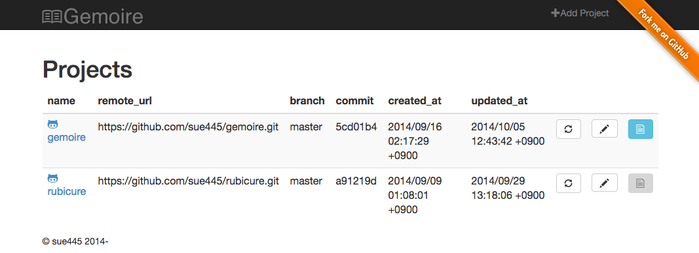
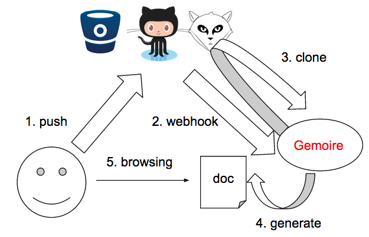

# Gemoire
Gemoire (Gem + grimoire) is [YARD](http://yardoc.org/) hosting app, like [RubyDoc.info](http://rubydoc.info/)

[](https://travis-ci.org/sue445/gemoire)
[](https://gemnasium.com/sue445/gemoire)
[](https://codeclimate.com/github/sue445/gemoire)
[](https://coveralls.io/r/sue445/gemoire?branch=master)

[](http://waffle.io/sue445/gemoire)

[](https://heroku.com/deploy)

## Overview




## Features
* clone/fetch git repository
* generate and browse yard document
* webhooks
  * Github :octocat:
  * Bitbucket
  * Gitlab

## Requirements
* Ruby 2.1.5
* some DBs: MySQL, PostgreSQL or sqlite3
* git 1.6+
* redis

## Setup
```bash
cp config/global/gemoire.yml{.example,}
cp config/global/redis.yml{.example,}
vi config/global/gemoire.yml
vi config/global/redis.yml

#####
cp config/database.yml{.sqlite3,}
# or
cp config/database.yml{.mysql,}
# or
cp config/database.yml{.postgresql,}
#####

vi config/database.yml

bundle install
bundle exec padrino rake ar:create ar:migrate

# setup admin user/pass
bundle exec rake db:seed
```

## Run development
```bash
bundle exec padrino start
bundle exec sidekiq -r ./config/sidekiq.rb
# or
bundle exec foreman start
```

## Test
```bash
RACK_ENV=test bundle exec rake ar:migrate
bundle exec rspec
```

## Sandbox
http://gemoire.herokuapp.com/

## for Heroku
```bash
vi config/global/gemoire.yml.heroku
vi config/global/redis.yml.heroku
```

### :warning: Caution
* generated document and cloned repository are cleared each deploy
* can not use `ssh://` at `remote_url`

## more documents
* [deploy key](doc/deploy_key.md)
* [webhook](doc/webhook.md)

