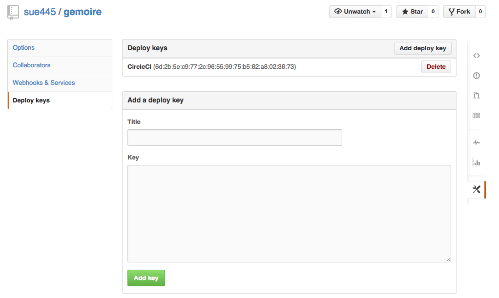
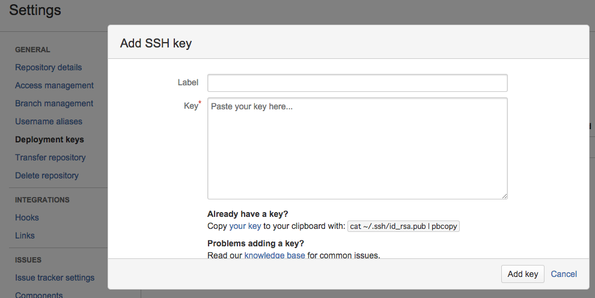
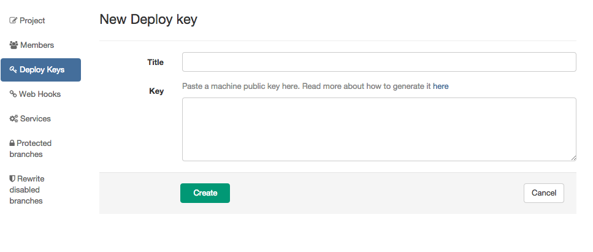

# Deploy key
If you want to use ssh protocol, you must create sidekiq user's ssh key and register deploy key to repository

because sidekiq must be able to `git clone`

## Check sidekiq user
```bash
$ ps aux | grep sidekiq
root      1801  0.2  5.0 370960 104692 ?       Sl   01:37   2:33 sidekiq 3.2.5 [0 of 25 busy]
11467    15161  0.0  0.0   7408   868 pts/0    S+   21:57   0:00 grep sidekiq
```

## generate ssh key
**example** sidekiq is running as `root`

```bash
sudo -u root ssh-keygen -t rsa -f /root/.ssh/id_rsa_gemoire
sudo vi /root/.ssh/config
```

```
Host github.com
  IdentityFile  /root/.ssh/id_rsa_gemoire
Host bitbucket.org
  IdentityFile  /root/.ssh/id_rsa_gemoire
```

## register deploy key
```
sudo cat /root/.ssh/id_rsa_gemoire.pub
```

### github


### bitbucket


### gitlab


## connection test and register to known_hosts

```
sudo -u root ssh -T git@github.com
sudo -u root ssh -T git@bitbucket.org
```
