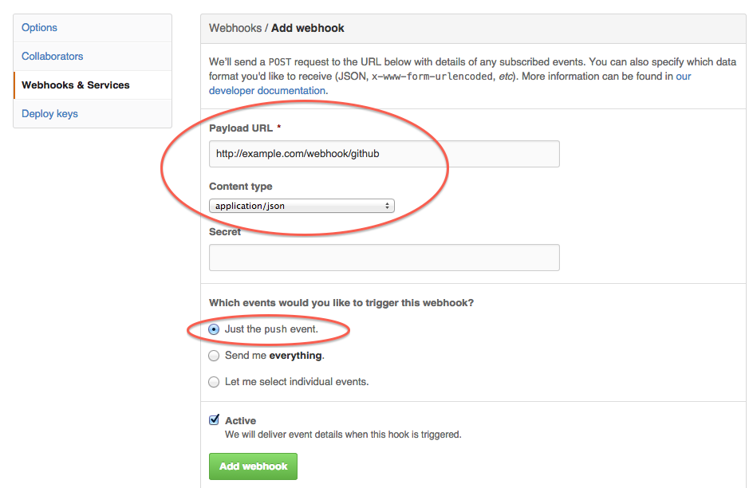
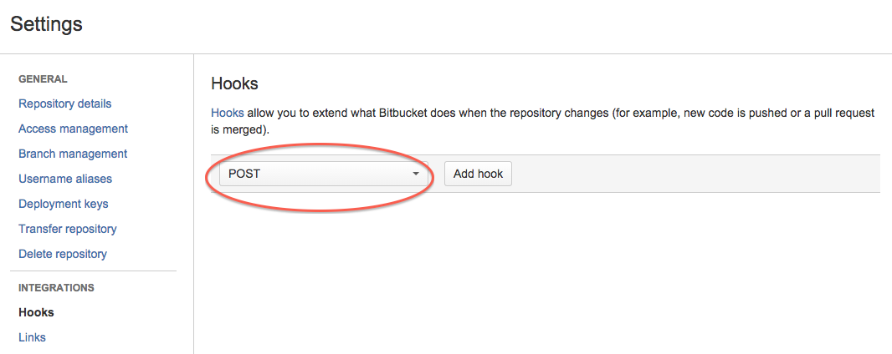
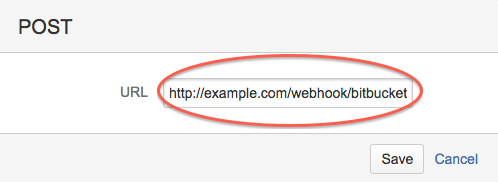
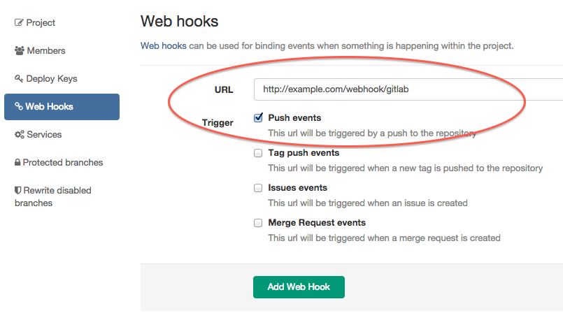

# Webhooks

Gemoire support some webhooks.

When received POST request, regenerate project document

## General
### Request
json payload

### Response code
* 200 : success
* 400 : payload is invalid json format
* 404 : not found projects that is matched `remote_url` or `repository_url`

## Simple webhook

### Endpoint
`/webhook`

### test hook

```bash
curl  -v -H "Accept: application/json" -H "Content-type: application/json" \
-X POST -d '{"remote_url": "https://github.com/sue445/sample-repo.git", "branch": "master"}' \
http://localhost:3000/webhook
```

## for Github

### Endpoint
`/webhook/github`

### Setting
Setting -> Webhooks & Services -> Add Webhooks



## for Bitbucket

### Endpoint
`/webhook/bitbucket`

### Setting
Settings -> Hooks

Choose "POST" and click "Add hook"



And input endpoint url 



## for Gitlab
recommend 6.7.0+

### Endpoint
`/webhook/gitlab`

### Setting
Setting -> Web Hooks


